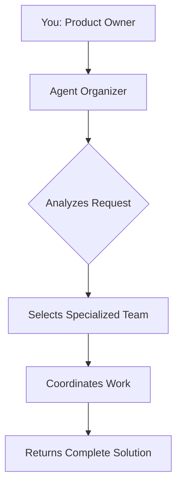

# Multi-Agent System Guide for Cursor

## 🎯 The Agent Dispatch Workflow

This project includes 40 specialized AI subagents that can work together to accomplish complex tasks. You act as the product owner, and the agents coordinate to deliver solutions.

### Architecture



## 🚀 Quick Start

### Invoke the Agent Organizer

Simply start your request with the agent-organizer:

```
Use the agent-organizer subagent to build a user authentication system 
with email/password and OAuth support for my Rails application.
```

### What the Agent Organizer Does

1. **Analyzes your project** - Examines codebase, tech stack, architecture
2. **Breaks down the task** - Decomposes request into phases
3. **Selects the right agents** - Chooses specialized agents
4. **Creates execution plan** - Defines how agents work together
5. **Coordinates delegation** - Uses Task tool to delegate
6. **Synthesizes results** - Combines work into cohesive solution

## 📋 Real-World Example

### Your Request:
```
Use the agent-organizer to add user authentication to my React e-commerce app, 
make it secure, and document the API endpoints. Backend uses Node.js/Express.
```

### Agent Organizer Response:

**Project Analysis:**
- Detected: React frontend, Node.js/Express backend
- Architecture: Full-stack SPA with RESTful API
- Requirements: Auth system + security + API docs

**Selected Agent Team:**
1. **backend-architect** - Design auth system architecture
2. **security-auditor** - Security review and validation  
3. **api-documenter** - Create API documentation

**Execution Plan:**
- **Phase 1**: backend-architect designs JWT implementation
- **Phase 2**: backend-architect implements endpoints
- **Phase 3**: security-auditor reviews for vulnerabilities
- **Phase 4**: api-documenter creates OpenAPI specs

## 🔄 When to Use Agent Organizer

### Mandatory Delegation Triggers:
✅ **Code Generation** - Writing new files, classes, functions
✅ **Refactoring** - Modifying or restructuring existing code
✅ **Debugging** - Investigating and fixing bugs
✅ **Analysis** - Understanding or explaining the codebase
✅ **Adding Features** - Implementing new functionality
✅ **Writing Tests** - Creating test suites
✅ **Documentation** - Generating docs
✅ **Strategy & Planning** - Roadmaps, architecture decisions

### Simple Tasks (Handle Directly):
❌ Single-file edits
❌ Simple clarifications
❌ Quick fixes
❌ Minor typos

## 💡 Best Practices

### 1. Be Clear About Your Role
```
I'm the product owner. I need you to act as the agent-organizer and 
coordinate a team to build [feature]. Analyze the requirements, select 
the right specialists, and coordinate their work.
```

### 2. Provide Context
The more context you give, the better the agent-organizer can select agents:
- What's the tech stack?
- What's the current architecture?
- What are the constraints?
- What's the timeline/priority?

### 3. Let the Organizer Lead
```
Use the agent-organizer to implement user notifications.
I want email, SMS, and in-app notifications with a preference center.
```

The agent-organizer will:
- Select: backend-architect, frontend-developer, database-optimizer
- Plan: Database schema → API endpoints → UI components → Integration
- Execute: Delegates to each agent in sequence

### 4. Review and Iterate
After the agent-organizer completes:
- Review the work from each specialist
- Ask for adjustments: "The security-auditor found issues, have backend-architect fix them"
- The organizer can coordinate follow-up work

## 📦 Available Agents (40 Total)

### 🎯 Core Orchestration
- **agent-organizer** - Master orchestrator for complex, multi-agent tasks

### 💼 Business
- **product-manager** - Strategic product management and roadmap planning

### 🤖 Data & AI (9 agents)
- **ai-engineer** - LLM applications, RAG systems, prompt pipelines
- **data-engineer** - ETL/ELT pipelines, data warehouses, streaming
- **data-scientist** - SQL, BigQuery optimization, data insights
- **database-optimizer** - Query optimization, indexing, schema design
- **graphql-architect** - GraphQL APIs, federation, subscriptions
- **ml-engineer** - ML model deployment, MLOps, production systems
- **postgres-pro** - PostgreSQL and PgLite expertise
- **prompt-engineer** - Advanced prompting, agentic workflows

### 💻 Development (16 agents)
- **backend-architect** - Robust backend systems and APIs
- **frontend-developer** - React components, modern frontend
- **full-stack-developer** - End-to-end web applications
- **golang-pro** - Concurrent Go applications
- **legacy-modernizer** - Incremental system modernization
- **mobile-developer** - Cross-platform mobile (React Native, Flutter)
- **nextjs-pro** - Next.js applications with SSR/SSG
- **python-pro** - Idiomatic Python, async programming
- **rails-architect** - Scalable Rails architecture
- **react-pro** - Modern React patterns and optimization
- **ruby-on-rails-pro** - Rails conventions and best practices
- **typescript-pro** - Type-safe applications
- **ui-designer** - Visual design and design systems
- **ux-designer** - User research and experience design
- **dx-optimizer** - Developer experience optimization
- **electorn-pro** - Cross-platform desktop applications

### ☁️ Infrastructure (6 agents)
- **cloud-architect** - AWS/Azure/GCP infrastructure
- **deployment-engineer** - CI/CD pipelines, containerization
- **devops-incident-responder** - Production incident response
- **heroku-pro** - Heroku platform deployment
- **incident-responder** - Critical incident command
- **performance-engineer** - Performance strategy and optimization

### ✅ Quality & Testing (5 agents)
- **architect-review** - Architectural consistency review
- **code-reviewer** - Code quality and best practices
- **debugger** - Systematic error resolution
- **qa-expert** - Comprehensive QA processes
- **test-automator** - Automated testing strategy

### 🔒 Security
- **security-auditor** - Security assessments and pen testing

### 📚 Specialization
- **api-documenter** - OpenAPI specs, API documentation
- **documentation-expert** - Technical writing and docs

## 🎬 Example Commands

### For New Features:
```
Use agent-organizer: Build a payment processing system with Stripe integration
```

### For Refactoring:
```
Use agent-organizer: Refactor our monolith auth service into microservices
```

### For Bug Fixes:
```
Use agent-organizer: Fix the memory leak in the background job processor
```

### For Architecture:
```
Use agent-organizer: Design a scalable architecture for handling 1M+ users
```

### For Security:
```
Use agent-organizer: Conduct a security audit of our authentication system
```

### For Documentation:
```
Use agent-organizer: Create comprehensive API documentation with OpenAPI specs
```

## ⚙️ How It Works in Cursor

The workflow is:
```
You → agent-organizer → Task(backend-architect) → Result
                      → Task(security-auditor) → Result  
                      → Task(api-documenter) → Result
                      → Synthesized Final Output → You
```

**Key Points:**
- You explicitly invoke the **agent-organizer** subagent
- The organizer analyzes and plans
- It uses the **Task tool** to delegate to specialized agents
- Each agent runs in isolation with full context
- Results are returned to the organizer
- Organizer synthesizes the final output

## 📖 Agent Team Patterns

### Small Feature (3 agents):
- Developer specialist + Code reviewer + Test automator

### Full Feature (5-7 agents):
- Backend + Frontend + Database + Security + Documentation + Testing

### Architecture Change (4-5 agents):
- Architect + Legacy modernizer + DevOps + Performance + Documentation

### Bug Investigation (2-3 agents):
- Debugger + Code reviewer + (Optional) Performance engineer

### Security Review (3-4 agents):
- Security auditor + Backend architect + Code reviewer + Documentation

## 🔍 Follow-Up Questions

### Simple Follow-ups (Handle Directly):
- Clarification questions about previous work
- Minor modifications (fix typos)
- Single-step tasks taking less than 5 minutes

### Moderate Follow-ups (Use Previously Identified Agents):
- Building on existing work within same domain
- Extending or refining previous deliverables
- Tasks requiring 1-3 of the previously selected agents

### Complex Follow-ups (Re-run agent-organizer):
- New requirements spanning multiple domains
- Significant scope changes
- Tasks requiring different expertise than previously identified

## 💪 Pro Tips

1. **Start with Context**: Give the agent-organizer information about your project, tech stack, and goals
2. **Be Specific**: Clear requirements lead to better agent selection and results
3. **Trust the Process**: Let the agent-organizer coordinate - it knows which specialists to use
4. **Iterate**: Don't expect perfection on first pass - review and ask for refinements
5. **Learn the Agents**: Over time, you'll learn which agents excel at which tasks
6. **Use for Complex Tasks**: The multi-agent system shines on complex, multi-faceted problems

## 🎯 Success Metrics

You'll know the multi-agent system is working well when:
- ✅ Complex tasks are broken down into manageable phases
- ✅ The right specialists are automatically selected
- ✅ Code quality is high across all deliverables
- ✅ Security and testing are built-in, not afterthoughts
- ✅ Documentation is comprehensive and up-to-date
- ✅ Solutions are architecturally sound

## 🚧 Limitations

- Agents run in isolated contexts (don't share memory between tasks)
- Each agent invocation starts fresh
- The agent-organizer coordinates but doesn't maintain state between sessions
- You act as the integration point between agent outputs

## 📚 Further Reading

- See `.cursor/agents/agent-organizer.md` for the full agent-organizer specification
- Each agent file in `.cursor/agents/` contains detailed capabilities and workflows
- `AI/claude-code-sub-agents/CLAUDE.md` has the original design philosophy

---

**Remember**: You're the product owner. Use the agent-organizer to assemble and coordinate specialist teams to build your product features efficiently and with high quality.
